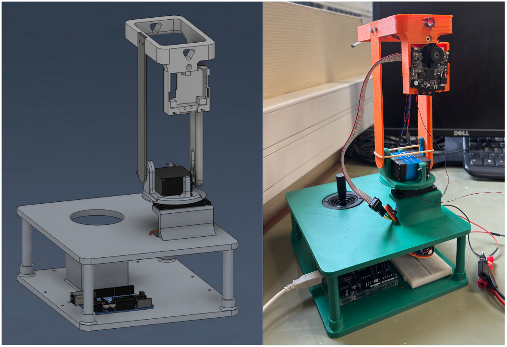

# TIPE – Tourelle de visée motorisée

<p align="center">
  
</p>

Conception et réalisation d'une tourelle motorisée pilotée par joystick, avec suivi automatique d'objet par caméra Pixy2.  
Projet mené dans le cadre de mon TIPE (2025-2026).

## 🎯 Objectif du projet

Développer un système de visée motorisé capable de :
- Être piloté manuellement via un joystick
- Suivre automatiquement un objet coloré en temps réel
- Servir de plateforme d'étude pour l'asservissement et la cinématique

## 📁 Structure du dépôt

\```
tipe-tourelle/
├── code/               # Code Arduino et simulation Wokwi
│   └── tipe_tourelle_visee.ino
├── cad/                # Modèles 3D FreeCAD & Fusion 360
├── images/             # Photos et captures d'écran
│   ├── systeme_complet.png
│   ├── Photo_des_pieces.png
│   ├── photo-0.png
│   ├── photo-1.png
│   ├── photo-2.png
│   ├── photo-3.png
│   ├── photo-4.png
│   ├── photo-5.png
│   └── Tour_modelisee_montee.png
├── docs/               # Documentation
│   └── description_pieces.md
└── README.md
\```

## 🛠️ Technologies utilisées

- **Microcontrôleur** : Arduino Uno
- **Langage** : C++ embarqué
- **Capteur** : Pixy2 CMUcam (reconnaissance couleur)
- **Actionneurs** : 2 servomoteurs FS5323M
- **Entrée** : Joystick analogique 2 axes
- **Simulation** : Wokwi
- **CAO** : FreeCAD & Autodesk Fusion 360

## 🎮 Fonctionnalités

### Mode Manuel
- Pilotage horizontal/vertical par joystick
- Zone morte configurable
- Vitesse progressive

### Mode Automatique
- Détection d'objets colorés
- Asservissement PD (Kp = 0,15, Kd = 0,05)
- Commutation manuel/auto par série

### Commandes série
- `a` : Mode automatique
- `m` : Mode manuel  
- `c` : Centrer la tourelle

## 🔫 Système de tir (Coilgun)

La tourelle intègre un canon électromagnétique (coilgun) en tête de système.

### Principe de fonctionnement
- Un banc de condensateurs (30 mF, 60 V) stocke l'énergie
- La décharge dans une bobine crée un champ magnétique puissant
- Une bille en acier (Ø 5 mm) est propulsée par effet magnétique

### Circuit électrique

| Composant | Valeur | Rôle |
|-----------|--------|------|
| Condensateur | 30 mF (3 × 10 000 μF / 63 V) | Stockage d'énergie |
| Bobine | L = 1,4 mH, rL = 3 Ω | Inducteur |
| Résistance série | 0,1 Ω | Limitation du courant |
| Résistance de charge | 100 Ω | Charge du condensateur |
| MOSFET | IRFB4227 | Interrupteur de puissance |
| Diode | 1N5408 | Protection flyback |
| Résistance de grille | 470 Ω | Pilotage MOSFET |

### Performances actuelles
- Énergie stockée : **54 J**
- Énergie transmise au projectile : ≈ **0,5 J** (rendement ≈ 1%)
- Portée : plusieurs mètres

### Améliorations envisagées
- [ ] Dimensionnement optimal de la bobine (calculs en cours)
- [ ] Remplacer le MOSFET par un IGBT (IGW60T120) pour supporter des courants plus élevés
- [ ] Commande du tir depuis l'Arduino (automatisation)
- [ ] Réduction de la résistance interne de la bobine pour améliorer le rendement

> Voir section 7 du rapport pour les détails de conception et les essais.

## 🔧 Installation

1. Cloner le dépôt
2. Câbler selon schéma (servos pins 9/10, joystick A0/A1)
3. Téléverser le code Arduino
4. Ouvrir le moniteur série (115200 bauds)

## 📊 Résultats

<p align="center">
  
</p>

## 🧩 État d'avancement

### Mécanique
- [x] Modélisation 3D complète (6 pièces)
- [x] Impression 3D
- [x] Assemblage final

### Électronique & Code
- [x] Simulation Wokwi
- [x] Câblage et tests
- [x] Code fonctionnel (manuel + auto)
- [x] Circuit coilgun opérationnel

### Système de tir
- [x] Banc de condensateurs 30 mF / 60 V
- [x] Bobine artisanale fonctionnelle
- [ ] Dimensionnement optimal de la bobine (calculs en cours)
- [ ] Amélioration du rendement énergétique

### Documentation
- [x] README
- [x] Description des pièces
- [ ] Rapport final (en cours - rédaction LaTeX)
- [ ] Schéma cinématique (graphe des liaisons)

## 📝 Licence

MIT - Libre d'utilisation
