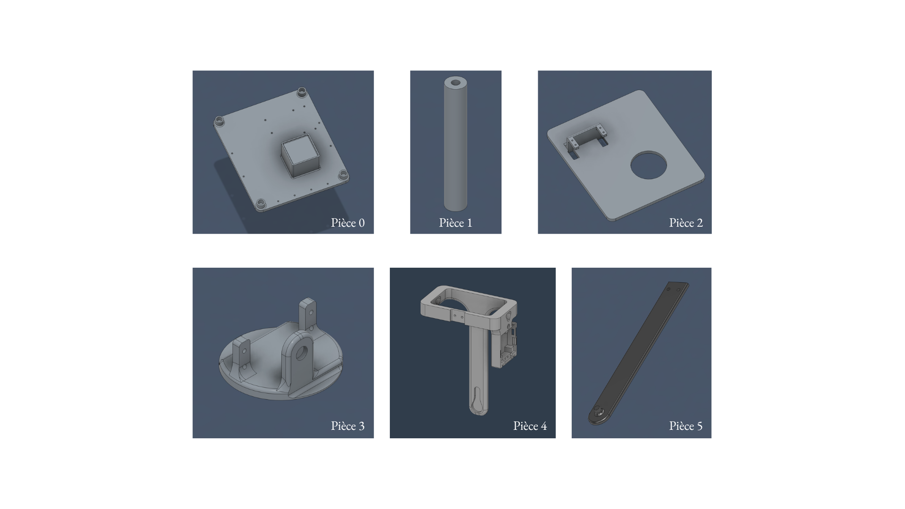

# Description des pièces mécaniques

Ce document décrit le rôle de chaque pièce modélisée sur FreeCAD et Fusion 360.  
Une version définitive (schéma cinématique, graphe de liaisons) sera rédigée dans le rapport final.

---

## Vue d'ensemble des 6 pièces

---

## Détail des pièces

| Pièce | Nom | Vue | Rôle |
|-------|-----|-----|------|
| **0** | Bâti (base fixe) |  | Base fixe de la tourelle. Accueille le breadboard, Arduino et joystick. Quatre logements cylindriques reçoivent les colonnes. |
| **1** | Colonne (×4) |  | Colonne cylindrique creuse imprimée en 4 exemplaires. Sert de support entre la pièce 0 et la pièce 2. |
| **2** | Plateau intermédiaire |  | Porte le servomoteur horizontal. S'emboîte sur les colonnes. Protège les composants électroniques. |
| **3** | Bras tournant |  | Encastré sur l'arbre du servo horizontal. Porte le servomoteur vertical. Logement pour roulement à billes. |
| **4** | Tête |  | Porte la caméra Pixy2, le laser et le **coilgun** (canon électromagnétique). Fixée sur le servo vertical. |
| **5** | Jonction |  | Vissée sur la pièce 4. Son cylindre se loge dans le roulement de la pièce 3, réalisant la liaison pivot. |

---

## Récapitulatif

| Pièce | Nom | Qté | Mouvement | Actionneur |
|-------|-----|-----|-----------|------------|
| 0 | Bâti | 1 | Fixe | - |
| 1 | Colonne | 4 | Fixe | - |
| 2 | Plateau intermédiaire | 1 | Fixe | - |
| 3 | Bras tournant | 1 | Rotation horizontale (pan) | Servo H |
| 4 | Tête | 1 | Rotation verticale (tilt) | Servo V |
| 5 | Jonction | 1 | Fixe (liaison pivot 3-4) | - |

